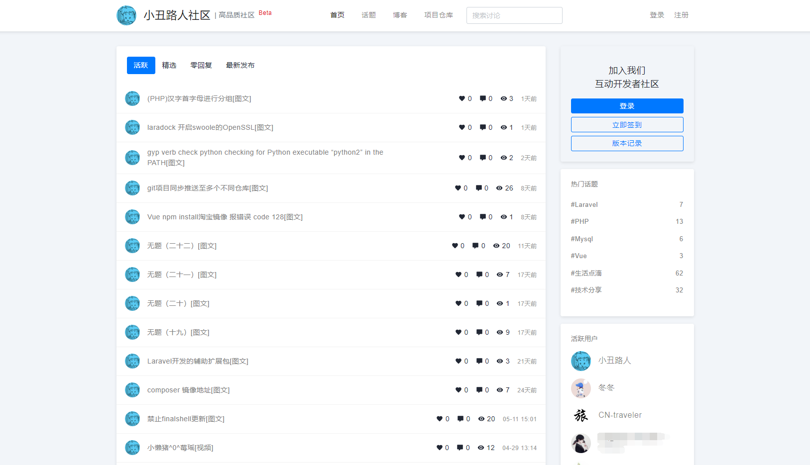
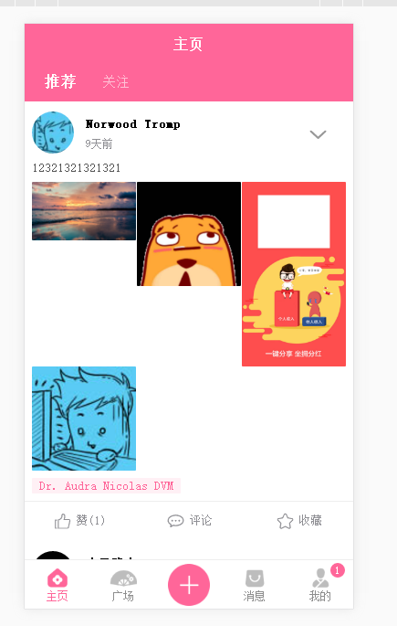
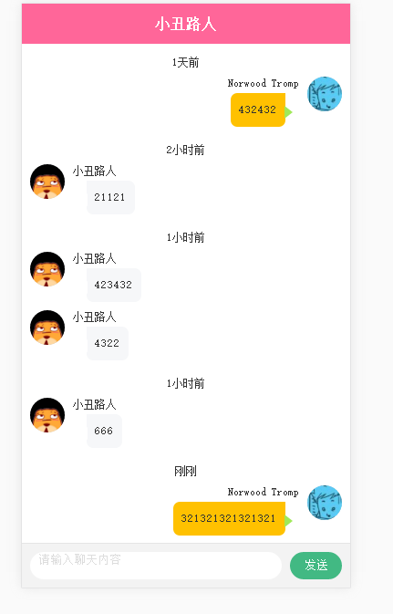
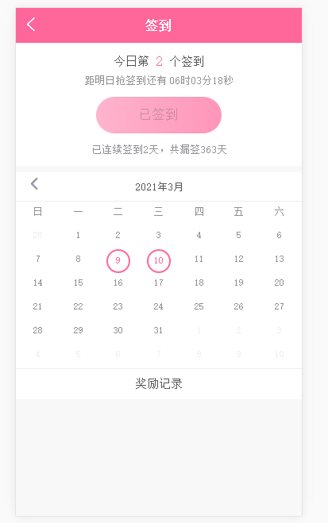

# 汉服荟社区

## [小丑路人社区](https://bbs.cnpscy.com)（PC端）

## 仿汉服荟（移动端）

#### 软件架构
软件架构说明（各自文件下有对应的安装流程介绍）
1. laravel APi
	* 编程语言：`PHP7.3+`
	* 后端框架： `Laravel8`
	* 前端Vue框架：`vue-element-admin`
	* Nodejs  v14.*
2. hyperf socket服务端
3. uni-app 汉服荟社区

### 他们正在使用
这些公司或软件正在使用我们的开源软件：
- [小丑路人·社区](https://bbs.cnpscy.com)
- [小丑路人·博客](https://www.cnpscy.com)

### 捐助
如果您觉得我们的开源软件对你有所帮助，请扫下方二维码打赏我们一杯咖啡。

.jpg")
 
### 联系
- 网站：
[小丑路人·社区](https://bbs.cnpscy.com)
- 邮箱:
`cnpscy@qq.com`